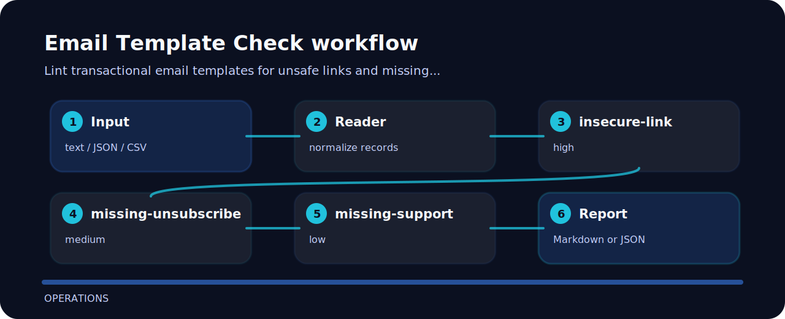

# Email Template Check

| Field | Value |
| --- | --- |
| Area | operations |
| Command | `email-template-check` |
| Example | `examples/sample.txt` |


Lint transactional email templates for unsafe links and missing unsubscribe language. The command is intentionally direct so it can sit in a local review, a CI step, or a one-off audit.

## What gets flagged

- `insecure-link` - insecure link detected (high); use HTTPS links.
- `missing-unsubscribe` - unsubscribe language missing (medium); add unsubscribe where required.
- `missing-support` - support contact missing (low); add support contact.

## Review path



## Command path

```bash
git clone https://github.com/mertefekurt/email-template-check.git
cd email-template-check
python -m pip install -e ".[dev]"
email-template-check examples/sample.txt
```
